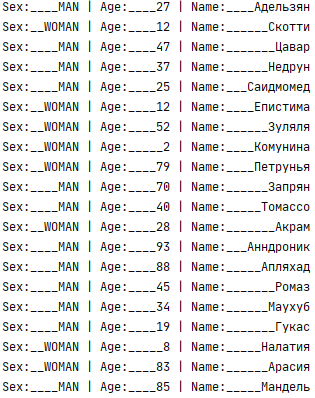
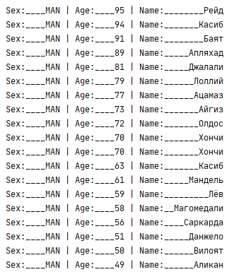
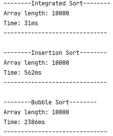
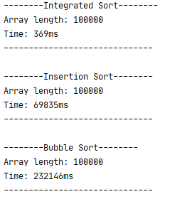

## Домашнее задание 4
**Задание**

Дан массив объектов Person. Класс Person характеризуется полями age (возраст, целое число 0-100), sex (пол – объект класса Sex со строковыми константами внутри MAN, WOMAN), name (имя - строка). Создать два класса, методы которых будут реализовывать сортировку объектов. Предусмотреть единый интерфейс для классов сортировки. 

Реализовать два различных метода сортировки этого массива по правилам:

* первые идут мужчины;
* выше в списке тот, кто более старший;
* имена сортируются по алфавиту.

Программа должна вывести на экран отсортированный список и время работы каждого алгоритма сортировки.
Предусмотреть генерацию исходного массива (10000
 элементов и более). Если имена людей и возраст совпадают, выбрасывать в программе пользовательское исключение.
 
 ---
 **Решение**
 
 Результатом выполнения домашнего задания стал отдельный модуль проекта. Реализованные все основные моменты в соответствии с требованиями задания:
 * Классы Person, Sex;
 * Два класса сортировки BubbleSort и InsertionSort, единый интерфейс Sort;
 * Правила сортировки установлены в классе Person - в методе compareTo() из интерфейса Comparable;
 * Реализована генерация исходного массива (с помощью метода getRandomInstance() класса Person, утилитных классов);
 * После сортировки идёт проверка массива на дубликаты, при нахождении которых гененируются и обрабатываются исключения;
 
 ---
**Пример вывода неотсортированного массива:**

 
 
**Вывод отсортированного массива:**

 
 
**Пример служебного сообщения после сортировки (10т. элементов):**
 
 
 
 **Пример служебного сообщения после сортировки (100т. элементов):**
  
  